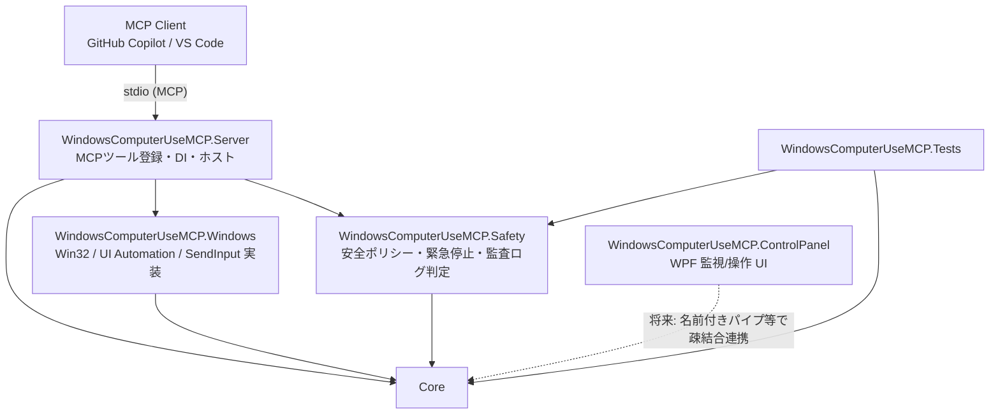

# ARCHITECTURE

## 目的

GitHub Copilot などの AI エージェントが MCP (Model Context Protocol) 経由で、
Windows 上の任意のデスクトップアプリケーションを人間と同じ手段（画面認識・マウス・キーボード・UI Automation）
で操作できるようにするローカルツール群。特定アプリ専用のコードは持たず、汎用的な「Computer Use」ツールを提供する。

### 想定操作対象アプリの分類

エージェントが実際に触れる可能性があるアプリは、UI の実装方式によって操作の得意・不得意が大きく異なる。
設計段階で以下のカテゴリを意識する。

| 分類 | 例 | 主な操作経路 |
|---|---|---|
| 標準コントロール中心 | メモ帳、エクスプローラー、電卓、多くの設定画面 | UI Automation (`ui_get_tree` / `ui_find` / `ui_invoke`) を優先 |
| Web/Chromium ベース (Electron/WebView2) | Clipchamp (デスクトップ版), Teams, VS Code | UI Automation は取得できるが要素数が多い/仮想化されている場合あり。座標クリックの併用が必要になりやすい |
| キャンバス/GPU 描画中心 | Blender, Adobe Photoshop/Premiere 等 | UI Automation ツリーが乏しい、または独自描画でアクセシビリティ情報が無い。`screen_capture` + `mouse_move` / `mouse_click` + `wait_for_screen_change` による「見て操作する」経路が中心になる |

このため MVP では UI Automation 経路（電卓・メモ帳）を先に固め、キャンバス系アプリへの本格対応は
座標クリック系ツールと画面差分検出 (`wait_for_screen_change`) が揃うフェーズ5・6以降の検証対象とする。
Blender / Adobe 系 / Clipchamp のような複雑なアプリを個別コード無しに操作できることが、
本プロジェクトの汎用性を証明する最終的な指標となる（ROADMAP.md 参照）。

## レイヤー構成



- **Core**: MCP にも Windows 実装にも依存しない、インターフェースと DTO のみの層。OS 非依存でユニットテストしやすい。
- **Windows**: Core のインターフェースを Win32 API / UI Automation / SendInput で実装する層。P/Invoke はここに閉じ込める。
- **Safety**: 危険操作判定・許可リスト・連続操作回数制限・緊急停止状態を扱う層。Core のモデルのみに依存し、Windows 依存を持たない（テスト容易性のため）。
- **Server**: MCP サーバー本体。Core/Windows/Safety を DI で組み立て、MCP ツールとして公開する。標準出力は MCP 通信専用。
- **ControlPanel**: ローカル監視用 WPF アプリ。Server とは疎結合とし、将来的に名前付きパイプ等の IPC で連携できる構造にする（直接プロジェクト参照はしない）。
- **Tests**: xUnit によるユニットテスト。OS 状態に依存しすぎない Core/Safety のロジックを重点的にテストする。

## プロジェクト間参照

```
Core            (依存なし)
Safety   -> Core
Windows  -> Core
Server   -> Core, Safety, Windows
ControlPanel -> Core
Tests    -> Core, Safety
```

Windows 固有 API（P/Invoke, UI Automation）は `WindowsComputerUseMCP.Windows` にのみ存在させ、
`Server` や `ControlPanel` から直接 P/Invoke しないことで、テスト容易性と責務分離を保つ。

## ターゲットフレームワーク方針

| プロジェクト | TFM | 理由 |
|---|---|---|
| Core | `net10.0` | OS非依存。将来的な多角展開・テスト容易性のためWindows専用APIに依存させない |
| Safety | `net10.0` | ロジックのみ。OS状態に依存しすぎないテストを可能にする |
| Windows | `net10.0-windows` | Win32 API・UI Automation (UIAutomationClient) 利用のため |
| Server | `net10.0-windows` | 実行時は常にWindows。Windowsプロジェクトを直接参照するため |
| ControlPanel | `net10.0-windows` + WPF | WPFはWindows Desktop SDKが必要 |
| Tests | `net10.0` | Core/Safetyのみを対象とする現段階ではOS非依存を維持 |

（当初は .NET 8 を基本として設計したが、開発機に .NET 10 SDK / ランタイムが導入済みであることを踏まえ、
.NET 10 に統一した。net10.0-windows は WPF/WinForms を含む Windows Desktop SDK を引き続きサポートしている。）

## 採用予定の主要 NuGet パッケージ（フェーズ1調査時点）

| パッケージ | 用途 | 選定理由 |
|---|---|---|
| `ModelContextProtocol` (v2.0.0) | MCP サーバー実装（公式 C# SDK） | modelcontextprotocol 公式 SDK。stdio トランスポート・DI・属性ベースのツール登録に対応し、活発にメンテナンスされている |
| `Microsoft.Extensions.Hosting` (8.x) | 汎用ホスト・DI・ロギング統合 | `ModelContextProtocol` の `AddMcpServer()` 拡張が `IHostBuilder` 前提であり、標準的な.NET DIパターンに合致 |
| `FlaUI.UIA3` (5.x) | UI Automation (UIA3) のラッパー | 生のCOM相互運用より安全にUI Automationを扱える。活発にメンテナンスされているOSSで、非推奨ではない |
| `Microsoft.Windows.CsWin32` (0.3.x, ビルド時ソースジェネレーター) | Win32 P/Invoke シグネチャ生成 | Microsoft公式のP/Invoke生成ツール。手書きDllImportより安全なマーシャリング・型を得られる。実行時依存にはならない（開発時のみ） |
| `xunit` / `xunit.runner.visualstudio` / `Microsoft.NET.Test.Sdk` | 単体テスト | .NETエコシステムで標準的かつ活発にメンテナンスされているテストフレームワーク |

これらは非推奨・保守停止済みのライブラリではないことを NuGet.org 上のバージョン履歴で確認済み。
実際のバージョンはフェーズ2のプロジェクト作成時に `dotnet add package` で最新安定版を再確認して固定する。

## MCP SDK 選定理由（詳細）

- `ModelContextProtocol` は Model Context Protocol の公式 C# SDK（github.com/modelcontextprotocol/csharp-sdk）であり、
  2.0.0 で安定版としてリリースされている。
- stdio トランスポートを標準サポートしており、GitHub Copilot / VS Code からの `stdio` 起動という要件に直接合致する。
- `Microsoft.Extensions.Hosting` ベースで `builder.Services.AddMcpServer().WithStdioServerTransport().WithToolsFromAssembly()`
  という宣言的な登録が可能で、属性 (`[McpServerTool]`) ベースでツールをCore/Windows実装から分離して公開できる。
- 独自のJSON-RPCフレーミング実装を自前で書く必要がなく、保守性・セキュリティ面で有利。

## Windows UI Automation / SendInput 実装方針

### UI Automation

- `FlaUI.UIA3` を利用し、`AutomationElement` ツリーを Core の `UiElementInfo` DTO に変換する。
- ツリー探索は `TreeWalker` を用い、`maxDepth` / `maxElements` を必ず適用してから返却する（無制限探索を禁止）。
- `InvokePattern` 等、要素がサポートするパターンのみを使用する。未対応の場合は座標クリックへ自動フォールバックせず、
  `NotSupported` 系の結果を返す（ツール呼び出し元の判断に委ねる）。

### SendInput（マウス・キーボード）

- マウス移動・クリック・ドラッグ・スクロール、キーボード入力・キー押下・ホットキーはすべて `SendInput` (user32.dll) を基本とする。
- 座標は仮想スクリーン座標（`SM_XVIRTUALSCREEN` 等）を用い、マルチモニター環境を考慮する。
- DPI スケーリングは、プロセスを Per-Monitor V2 DPI Aware として明示的に宣言し（アプリマニフェスト or `SetProcessDpiAwarenessContext`）、
  座標変換のズレを避ける。
- キーボード入力はスキャンコードではなく Unicode 入力 (`KEYEVENTF_UNICODE`) を用いることで、IME非依存かつ任意のUnicode文字を送出できるようにする。
- クリップボード貼り付け（`Ctrl+V`）だけに依存したテキスト入力は行わない（要件どおり）。

### P/Invoke の分割方針

`WindowsComputerUseMCP.Windows` 内で以下のようにファイル/クラスを目的別に分割する（フェーズ3以降で具体化）。

- `NativeMethods.Window.*` — ウィンドウ列挙・前面化・サイズ位置取得
- `NativeMethods.Input.*` — SendInput 関連
- `NativeMethods.Dpi.*` — DPI / マルチモニター関連
- `NativeMethods.Capture.*` — GDI/BitBlt もしくは Windows.Graphics.Capture によるキャプチャ

CsWin32 を使う場合も、生成対象 API を機能ごとに `NativeMethods.txt` を分割管理し、1ファイルに密集させない。

## 共通のツール結果モデル

すべての MCP ツールは Core 層で定義する共通結果型（`success`, `operationId`, `message`, `data`, `warnings`,
`errorCode`, `startedAt`, `completedAt`, `durationMs`）でラップして返却する。例外はツール層で捕捉し、
スタックトレースはクライアントへ渡さず診断ログにのみ記録する。

## 監査ログ・設定

`%LOCALAPPDATA%\WindowsComputerUseMCP\Logs` に JSON Lines 形式で操作監査ログを記録し、
`%LOCALAPPDATA%\WindowsComputerUseMCP` にユーザー設定を保存する。詳細は SECURITY.md を参照。
